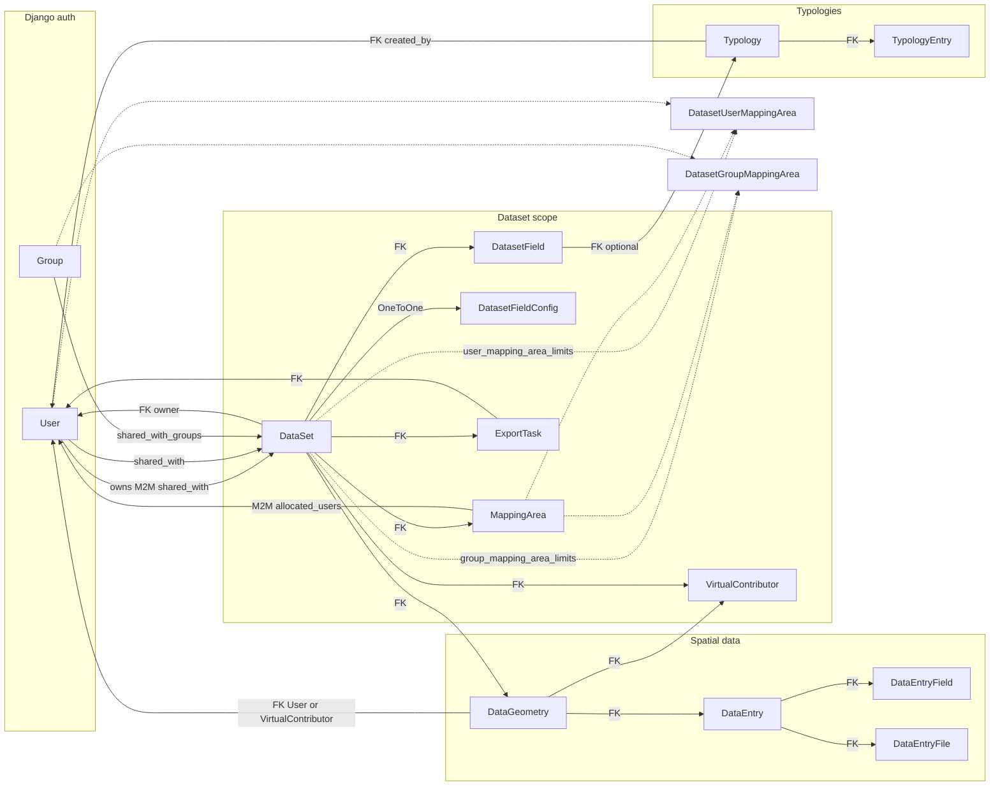

# Data model

Domain logic is concentrated in [`app/datasets/models.py`](../app/datasets/models.py). This page summarizes entities, relationships, and important behaviors.

## Entity summary

| Model | Role |
|-------|------|
| `AuditLog` | Optional audit entries: user, action, target, timestamp. |
| `DataSet` | Top-level container: owner, sharing, flags (public, multiple entries, mapping areas, anonymous token), map defaults. |
| `VirtualContributor` | Anonymous contributor identity when anonymous data input is enabled (`uuid`, display name, dataset). |
| `DataGeometry` | Point geometry (`Point`, SRID 4326), address, `id_kurz`, creator user or virtual contributor. |
| `DataEntry` | Belongs to a geometry; optional name/year; creator user or virtual contributor. |
| `DataEntryField` | Key/value storage for dynamic column data (`field_name`, `field_type`, `value` text). |
| `DataEntryFile` | Uploaded file metadata linked to an entry. |
| `Typology` | Named taxonomy; `created_by`, `is_public`. |
| `TypologyEntry` | Rows in a typology: `code`, `category`, `name`; unique per `(typology, code)`. |
| `DatasetFieldConfig` | Legacy-style single-row labels/toggles per dataset (usage codes, categories, year/name labels). |
| `DatasetField` | Per-dataset field definitions for forms/import: type, order, typology links, coordinate/id/address flags, `non_editable`. |
| `ExportTask` | Async ZIP export job: `task_id`, status, paths, filters (`file_types`, dates, `organize_by`, metadata flag). |
| `MappingArea` | `MultiPolygonField` per dataset; optional `allocated_users` M2M. |
| `DatasetUserMappingArea` | Restrict a **user** to specific mapping areas on a dataset. |
| `DatasetGroupMappingArea` | Restrict a **group** to specific mapping areas on a dataset. |

## Relationships (mermaid)

## Dataset access (`DataSet`)

- **`can_access(user)`**: Returns true if the user is superuser, dataset is public, user is owner, is in `shared_with`, or belongs to any group in `shared_with_groups`.

## Mapping areas

When **`enable_mapping_areas`** is on and the dataset has mapping areas:

- **`get_user_mapping_area_ids(user)`**: Returns `None` for full access (superuser, owner, or no mapping areas on dataset). Otherwise returns combined IDs from per-user limits, per-group limits (via the user’s Django groups), and areas where the user is listed in **`allocated_users`**. Empty combined set yields restrictive behavior when filtering (see below).

- **`filter_geometries_for_user(geometries_qs, user)`**: Restricts a queryset of geometries to points **`within`** allowed mapping polygons (OR across areas).

- **`user_has_geometry_access(user, geometry_obj)`**: Checks coverage using **`geometry__covers`** against allowed areas.

## Geometry uniqueness

[`DataGeometry`](../app/datasets/models.py) uses partial unique constraints:

- Logged-in contributors: unique `(dataset, id_kurz)` when `virtual_contributor` is null.
- Anonymous contributors: unique `(dataset, id_kurz, virtual_contributor)` when virtual contributor is set.

## Field typing

`DataEntryField` and `DatasetField` support types such as text, textarea, integer, decimal, boolean, date, choice, multiple choice, and headline (see `FIELD_TYPE_CHOICES` in the model). **`get_typed_value()`** on `DataEntryField` parses stored text into Python types; multiple choice may be JSON or comma-separated.

## Dataset field ordering

[`DatasetField.order_fields`](../app/datasets/models.py) orders fields so negative **`order`** values sort after positive ones (implementation uses a `Case`/`When` annotation).

## Related reading

- [Security and access control](security-and-access-control.md) — how rules apply in views.
- [Routing and views](routing-and-views.md) — CRUD entry points.
